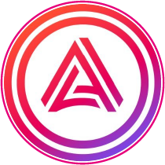
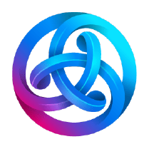
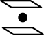
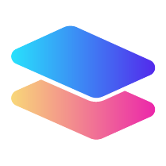
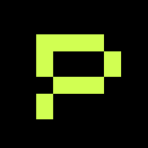

# PolkaCharity
 
 

PolkaCharity Description

# Watch our demo video:

# Test the product:

## URL: https://www.polkacharity.site/

## Requirements

- Use Moonbeam Mainnet on Metamask Wallet!
  - Get it on Metamask: https://metamask.io/
  - https://docs.moonbeam.network/tokens/connect/metamask/

- Use Polkadot Parachains (Mainnets) on PolkadotJS Wallet!
  - Get it on PolkadotJS: https://polkadot.js.org/extension/

# Diagram:

## Tech we Use:

- Polkadot Network:
  - Utilizacion de PolkadotJS para mandar tokens desde las parachains compatibles con XCM directo a Moonbeam.
    - https://docs.moonbeam.network/builders/interoperability/xcm/xc20/xc20/
  - Revision de los balances de cada token por network mediante la NodeJS Polkadot API.
    - https://www.npmjs.com/package/@polkadot/api
- Moonbeam Network:
  - Utilizacion de la Metamask Wallet para hacer donaciones de Glimmer
    - https://docs.moonbeam.network/tokens/connect/metamask/
  - Utilizacion de la libreria XCM para mandar y recibir Xtokens.
    - https://www.npmjs.com/package/@moonbeam-network/xcm-sdk
  - NFT Management, todos los NFT's que se den en la plataforma seran creados y mintados sobre la red de Moonbeam.
    - ERC721 Token [0xc2b0889F8171C1F5B6f11f76f7C25d6bBb830b5d](https://moonbeam.moonscan.io/token/0xc2b0889f8171c1f5b6f11f76f7c25d6bbb830b5d?a=0xf55285649c3413f57b95c49fbad71f0e5646fa14)
- Covalent:
  - Obtaining the account's GLMR and Xtokens (ERC20 Interface) Balances.
  - Obtaining the account's NFT Balances.
- Pokt Network
  - RPC personal para el proyecto y no tener las limitaciones el RPC publico.
- Livepeer:
  - RTMP URL:
    - Url to easily transmit from the OBS and start our transmission.
  - Livestreams and Recordings API:
    - Obtaining the url if a streamr is live.
    - Obtaining the last record of each streamer if he is offline.
- EC2:
  - Public Chat:
    - Para hacer el chat publico se utilizo un WebSocketSecure instalado en una maquina virtual de EC2 en AWS.

# How it's built:

## Moonbeam Network:

La red de Moonbeam se utilizo para todo el control de Sign-in del chat, gestion de Glimmer (Native Token) y todos los X-Tokens compatibles con XCM. Esto con el fin de poder recibir tokens de cualquiera de las parachain en el ecosistema de Polkadot.

Para poder obtener los balances de cada uno de los X-Tokens en la red de Moonbeam se utilizo la interfaz ECR20 del siguiente contrato, este es el contrato estandard de ERC20 para cualquier EVM, todo esto controlado por la libreria [Ethers.js](https://docs.ethers.org/v5/).

    async getBalanceToken(address, tokenAddress) {
            return new Promise(async (resolve, reject) => {
                const contract = new ethers.Contract(tokenAddress, abiERC20, this.provider);
                let res = await contract.balanceOf(address)
                let decimals = await contract.decimals()
                resolve(res / (Math.pow(10, decimals)))
            })
        }

[Complete Code](./WebDApp/src/components/summary.js)

Dentro de nuestra plataforma tenemos un summary donde podemos ver todas las donaciones en tiempo real.

A su vez todos los NFT's que desplegamos en la plataforma y que son el modo de premiar a los usuarios que donaron dinero en cada red, estan sobre la red de Moonbeam Mainnet en el siguiente contrato.

[Moonbeam Explorer](https://moonbeam.moonscan.io/token/0xc2b0889f8171c1f5b6f11f76f7c25d6bbb830b5d?a=0xf55285649c3413f57b95c49fbad71f0e5646fa14)

El codigo de Solidity que se uso para ellos es el siguiente.

[NFT Code](./Contracts/NFT.sol)

Los trofeos que entregamos se ven en la plataforma de la siguiente forma.

## Polkadot Network:

Gracias a utilizar el [XCM-SDK](https://docs.moonbeam.network/builders/interoperability/xcm/xcm-sdk/xcm-sdk/) de Polkadot podemos realizar de forma sencilla las tranasferencias desde cualquiera de las parachains que tienen un contrato de X-Token desplegado en ellas.

- Para la fecha de hoy 02/17/23 las parachains mainnet compatibles con esta libreria son las siguientes.

  - Bifrost BNC 
  - Acala ACA 
  - Acala AUSD 
  - Astar ASTR 
  - Darwinia RING 
  - Interlay IBTC 
  - Interlay INTR 
  - Parallel PARA 
  - Phala PHA 
  - Polkadot DOT 
  - Statemint USDT 

Todas ellas son compatibles con las donaciones y es posible mandarlas mediante la Wallet Polkadot.js combinado con la libreria [@polkadot/extension-dapp](https://www.npmjs.com/package/@polkadot/extension-dapp)

## Covalent:

Our application by requiring that we quickly look up if it has NFT's in it, we were able to find a way to do it efficiently from the Covalent API's.

    async syncNFT(address) {
        let temp = await axios({
            method: 'get',
            url: `https://api.covalenthq.com/v1/1284/address/${address}/balances_v2/?key=${process.env.REACT_APP_Covalent}&format=JSON&nft=true&no-nft-fetch=false`,
            headers: {
                'Accept': 'application/json'
            }
        })
        temp = temp.data.data.items.filter(item => item.type === "nft");

        this.setState({
            nfts: temp[0].nft_data
        })
    }

[Complete Code](./WebDApp/src/components/header.js)

## Livepeer:

All the streaming services were done through Livepeer.

To manage Streamers, the profiles of each of the Streamers were created within the Livepeer dashboard, with which we were able to provide each Streamer with their keys to perform their Streams.

Thanks to the Livepeer APIs it was possible for us to obtain if the Streamers were doing a Live, thanks to this the viewers could always be aware when a live stream is made.

The section of code that allows us to obtain the profiles, recordings and states (live or offline) is the following.

Code Snippet:

    var myHeaders = new Headers();
    myHeaders.append("authorization", process.env.REACT_APP_LIVEPEER_BEARER);

    var requestOptions = {
        method: 'GET',
        headers: myHeaders,
        redirect: 'follow'
    };

    fetch("https://livepeer.com/api/stream?streamsonly=1", requestOptions)
        .then(response => response.text())
        .then(async (result) => {
            let res = JSON.parse(result).filter((item) => item.id === this.data.streamID)
            let live = res[0]?.isActive ?? false
            this.setState({
                live
            })
        })

    fetch(`https://livepeer.com/api/stream/${this.data.streamID}/sessions?record=1`, requestOptions)
        .then(response => response.text())
        .then(async (result) => {
            let recordId = JSON.parse(result)[0].id
            this.setState({
                recordId
            })
        })
        .catch(error => console.log('error', error));

[Complete Code](./WebDApp/src/pages/streamer.js)
 
# References

https://www.twitch.tv/creatorcamp/en/connect-and-engage/charity-streaming/

https://www.donordrive.com/charity-streaming/

https://www.youtube.com/watch?v=Hh4T4RuK1H8